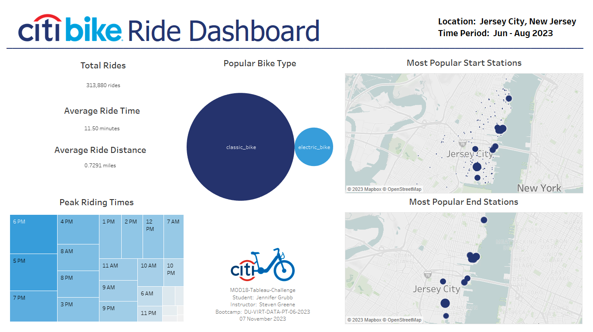

# MOD18-Tableau-Challenge
Student:  Jennifer Grubb  
Instructor:  Steven Greene  
Bootcamp:  DU-VIRT-DATA-PT-06-2023  
06 November 2023  

## Table of Contents
- [About](#about)
- [Contributing](#contributing)
- [Dataset](#dataset)
- [Summary](#summary)
  
## About
As the new lead analyst for the New York Citi BikeLinks, an external site program, you are now responsible for overseeing the largest bike-sharing program in the United States. In your new role, you will be expected to generate regular reports for city officials looking to publicize and improve the city program. Since 2013, the Citi Bike program has implemented a robust infrastructure for collecting data on the program's utilization. Each month, bike data is collected, organized, and made public on the Citi Bike DataLinks to an external site. webpage. However, while the data has been regularly updated, the team has yet to implement a dashboard or sophisticated reporting process. City officials have questions about the program, so your first task on the job is to build a set of data reports to provide the answers.  

## Contributing
N/A  

## Dataset
<a href="https://s3.amazonaws.com/tripdata/index.html">Citi Bike Trip History Data</a>  
    ∙ JC-202306-citibike-tripdata  
    ∙ JC-202307-citibike-tripdata  
    ∙ JC-202308-citibike-tripdata  
    
## Summary
<a href="https://public.tableau.com/views/CitiBikeRideDashboard/CitiBikeRideDashboard?:language=en-US&publish=yes&:display_count=n&:origin=viz_share_link">CitiBike Ride Dashboard</a>  

  
